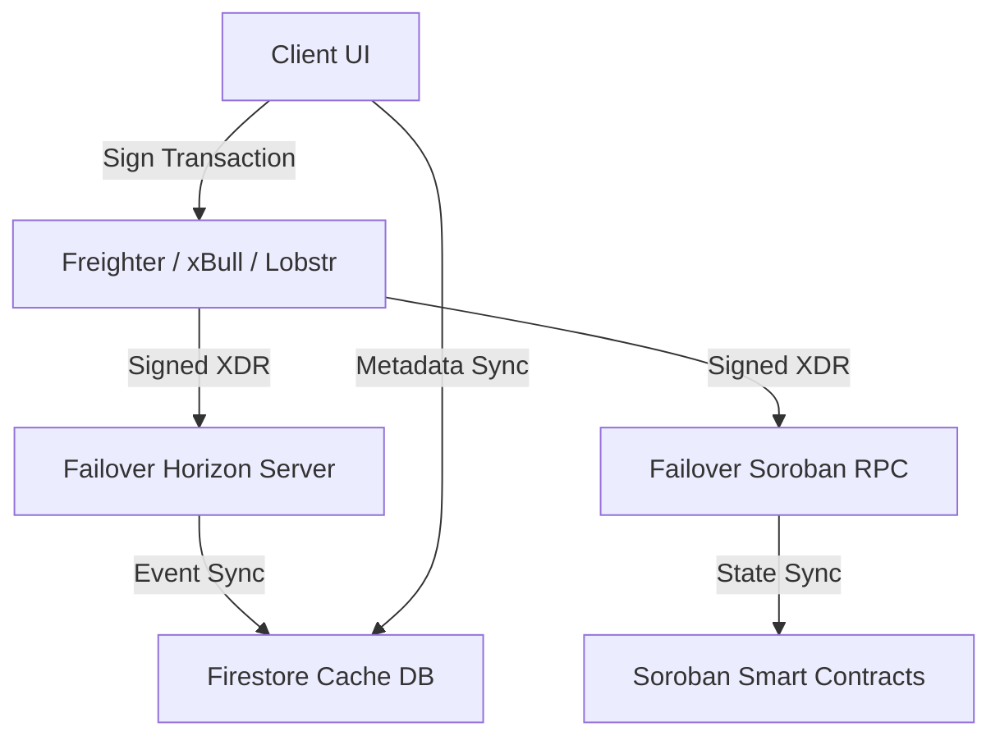
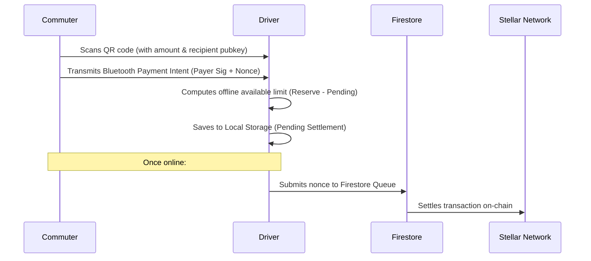

# 🌌 Aranova

[](https://stellar.org)
[](https://github.com/nextlevelbuilder/aranova)
[](LICENSE)
[](C:\Users\Renz%20Jericho%20Buday\.gemini\antigravity-ide\brain\f1cc7feb-6ac4-4302-abb7-aca32e9be040\final_independent_web3_production_audit.md)

Aranova is a **production-grade, decentralized non-custodial Web3 cooperative finance platform** engineered on top of the **Stellar Network** and **Soroban Smart Contracts**. 

Designed to optimize transit finance networks in emerging regions, Aranova eliminates cash-flow constraints by integrating micro-payments with on-chain credit systems, allowing commuters, drivers, and cooperatives to interact without custodial counterparty risk.

---

## 📖 Table of Contents
1. [Overview](#-overview)
2. [Key Features](#-key-features)
3. [Web3 Architecture](#%EF%B8%8F-web3-architecture)
4. [Technology Stack](#%EF%B8%8F-technology-stack)
5. [User Roles & Workflows](#%F0%9F%91%A5-user-roles--workflows)
6. [Offline Bluetooth Payment Protocol](#%F0%9F%93%B6-offline-bluetooth-payment-intent-protocol)
7. [Security Protocols](#%F0%9F%9B%A1%EF%B8%8F-security-protocols)
8. [Smart Contracts](#%F0%9F%A4%9D-smart-contracts)
9. [Repository Structure](#%F0%9F%93%81-repository-structure)
10. [Installation & Local Setup](#%F0%9F%92%BB-installation--local-setup)
11. [Environment Variables](#%F0%9F%94%A7-environment-variables)
12. [Testing](#%F0%9F%A7%AA-testing)
13. [Deployment](#%F0%9F%9A%80-deployment)
14. [Observability & Telemetry](#%F0%9F%93%8A-observability--telemetry)

---

## 🌌 Overview

Aranova enables automated credit flows, vault savings, and transit fee collection. Traditional transport networks suffer from fragmented micro-lending models, cash leakage, high remittance fees, and lack of credit history for unbanked operators. 

By leveraging **Stellar native assets** and **Soroban WebAssembly (WASM) smart contracts**, Aranova:
* Enforces programmatic split rules directly on-chain.
* Operates a non-custodial framework where users maintain full key ownership.
* Separates data caching layers (Firestore) from the financial ledger (Stellar Blockchain).
* Restricts microloans via trust scores computed entirely on-chain.

---

## ⚡ Key Features

### 🔑 Non-Custodial Wallet Management
* **Wallet Standard Compliant**: Direct integration with Freighter, xBull, and Lobstr browser extensions.
* **Cryptographic Local Key Derivation**: High-security backup encryption using 100,000 PBKDF2 iterations (HMAC-SHA256) combined with **Encrypt-then-MAC** (AES-CBC + HMAC-SHA256) tag verification.

### 💸 Decentralized Payments & Vaults
* **Online Transfers**: Instant native XLM transaction routing.
* **Offline Bluetooth QR Scans**: Peer-to-peer payment intent exchange with balance limit checks.
* **Automatic Vault Locking**: Configurable auto-savings (e.g., 5% routing) locked for up to 40 days to earn on-chain trust score points.

### 🏦 Automated Credit Lines
* **Fuel Credits**: Instant microloans with automated smart contract ceiling allocations.
* **System Loans**: Structured cooperative lending with custom parameters, admin sign-offs, and restructuring capabilities.

---

## 🏗️ Web3 Architecture

Aranova runs on a non-custodial, serverless client architecture:



* **Blockchain as the Ledger**: All financial states (Vault balances, Loan balances, Repayments, Trust Score weights) are queryable directly from the blockchain.
* **Firestore Caching Layer**: Firestore only logs UI layouts, sync queues, profiles, and transient synchronization data.

---

## 🛠️ Technology Stack

* **Frontend**: React, TypeScript, Vite, Tailwind CSS, Progress Web App (PWA).
* **Blockchain Ecosystem**: Stellar SDK, Soroban SDK, `@creit.tech/stellar-wallets-kit`, Horizon API.
* **Database & Auth**: Firebase Auth, Firestore.
* **Contracts Workspace**: Rust, Cargo, `soroban-sdk`.

---

## 👥 User Roles & Workflows

### 👑 Administrator
* Connects multiple extensions standard wallets.
* Modifies global rules (e.g. Vault penalties, loan parameters) on-chain.
* Reviews cooperative loan disbursements.

### 🏢 Cooperative
* Manages pools, deposits native funds, and defines driver loan ceilings.
* Approves micro-loan parameters.

### 🚍 Driver
* Requests automated Fuel Credits directly to their wallet.
* Reviews and signs System Loan terms using encrypted software keys or Freighter.
* Tracks daily earnings and triggers repayments.

### 🎒 Commuter
* Spends native funds on transit rides.
* Sets up Vault splits to lock portions of incoming cash.
* Executes offline payments during transit.

---

## 📶 Offline Bluetooth Payment Intent Protocol

For regions with poor cellular connectivity, Aranova implements a custom offline receipt exchange workflow:



* **Duplicate Prevention**: Nonces act as unique primary keys in Firestore `/offline_payments/`.
* **Queue Expiration**: Receipts older than 3 days are rejected as `expired_offline`.

---

## 🛡️ Security Protocols

1. **Firestore Least-Privilege Rules**: All collections require `request.auth != null`. Rules restrict drivers from editing terms of loans in `/fuel_requests` during signing transitions.
2. **Key Encryption**: AES-CBC + HMAC-SHA256 authenticated encryption ensures encrypted keys backed up to the cloud cannot be tampered with.
3. **VM Validations**: Soroban rust contracts strictly enforce `require_auth()` ownership checks and arithmetic bounds (`checked_add`, `checked_sub`).

---

## 🤝 Smart Contracts

### 📁 Vault Contract (`contracts/vault`)
* **Purpose**: Manages locked user assets.
* **Core Functions**:
  - `lock_funds(user, amount, duration)`
  - `redeem_matured_funds(user)`
  - `emergency_unlock(user)` (applies configured penalty rate)

### 📁 Fuel Credit Contract (`contracts/fuel_credit`)
* **Purpose**: Microloan allocation.
* **Core Functions**:
  - `borrow(user, amount)`
  - `repay(user, amount)`

### 📁 System Loan Contract (`contracts/system_loan`)
* **Purpose**: Structured cooperative loans.
* **Core Functions**:
  - `disburse(borrower, amount, terms)`
  - `repay(borrower, amount)`
  - `restructure(borrower, new_terms)`

---

## 📁 Repository Structure

```text
├── .agents/                 # AI configs & developer skills
├── aranova-frontend/        # React + TypeScript + Vite PWA frontend
│   ├── src/
│   │   ├── components/      # UI components & admin panels
│   │   ├── contexts/        # React authentication context
│   │   ├── pages/           # Dashboard routes (Admin, User, Vault)
│   │   ├── services/        # Failover servers & cryptography helpers
├── contracts/               # Cargo Soroban Rust smart contracts workspace
│   ├── fuel_credit/         # Fuel Credit contract
│   ├── system_loan/         # Cooperative lending contract
│   ├── trust/               # On-chain scoring weights
│   └── vault/               # Maturation lock savings contract
├── firestore.rules          # Firestore database security rules
├── firebase.json            # Firebase workspace deployment config
└── Cargo.toml               # Smart contract workspace layout
```

---

## 💻 Installation & Local Setup

### Prerequisites
* Rust toolchain with target `wasm32-unknown-unknown`
* Soroban CLI installed (`>= 20.0.0`)
* Node.js (`>= 18`)

### Step 1: Clone the Repository
```bash
git clone https://github.com/nextlevelbuilder/aranova.git
cd aranova
```

### Step 2: Install Frontend Dependencies
```bash
cd aranova-frontend
npm install
```

### Step 3: Compile Smart Contracts
From the root workspace folder, run:
```bash
cargo build --target wasm32-unknown-unknown --release
```

### Step 4: Run the Application Locally
```bash
cd aranova-frontend
npm run dev
```

---

## 🔧 Environment Variables

Create a `.env` file inside `aranova-frontend` folder:

| Variable | Description | Default / Example |
| :--- | :--- | :--- |
| `VITE_CONTRACT_ID` | Main deployed Soroban contract address | `CCXX5IPHC2I6U36ZP...` |
| `VITE_NETWORK` | Target network environment | `TESTNET` |
| `VITE_HORIZON_URL` | Horizon gateway endpoint | `https://horizon-testnet.stellar.org` |
| `VITE_SOROBAN_RPC_URL` | Soroban RPC gateway endpoint | `https://soroban-testnet.stellar.org` |

---

## 🧪 Testing

### Rust Contracts Verification
Execute contract tests locally in isolated mock environments:
```bash
cargo test --workspace --release
```

### Frontend Build Verification
Verify type-safety, bundling boundaries, and output optimization:
```bash
cd aranova-frontend
npm run build
```

---

## 🚀 Deployment

### Deploying Frontend to Firebase App Hosting / Hosting
Ensure Firebase CLI is logged in and run:
```bash
firebase deploy --only hosting
```

### Deploying Smart Contracts
Build and deploy WASM binaries to Stellar Testnet:
```bash
soroban contract deploy \
  --wasm target/wasm32-unknown-unknown/release/vault_contract.wasm \
  --source my-admin-key \
  --network testnet
```

---

## 📊 Observability & Telemetry

Errors, RPC timeouts, Horizon outages, and contract VM execution failures are automatically captured by [observabilityService.ts](file:///c:/Users/Renz%20Jericho%20Buday/aranova/aranova-frontend/src/services/observabilityService.ts) and logged to Firestore `/telemetry_logs/`. This provides administrators with real-time network stability dashboards.
